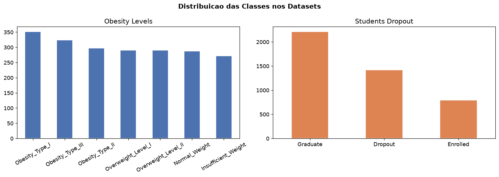
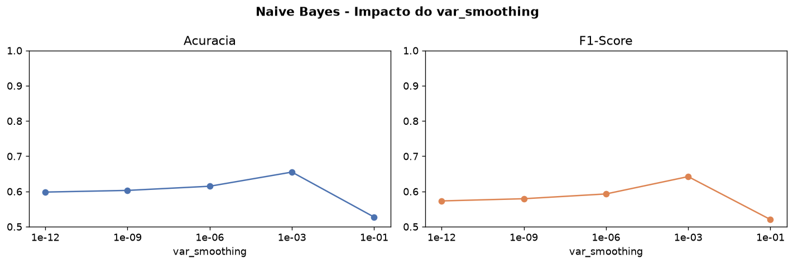
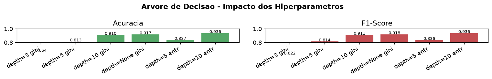
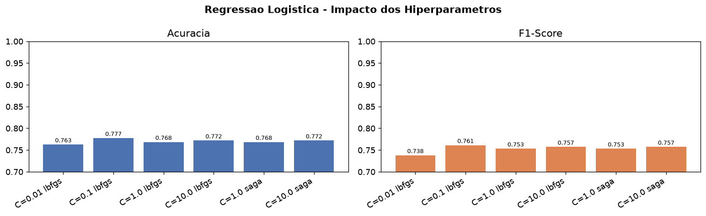
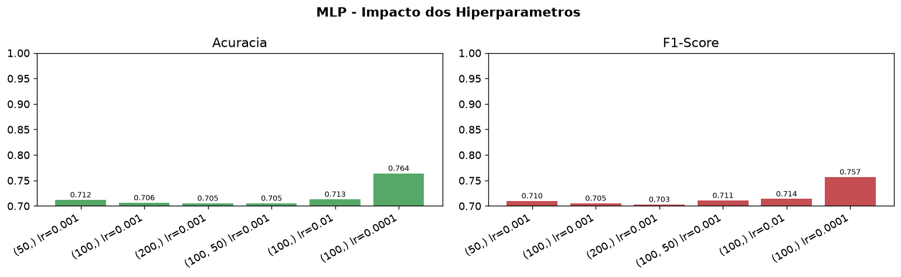
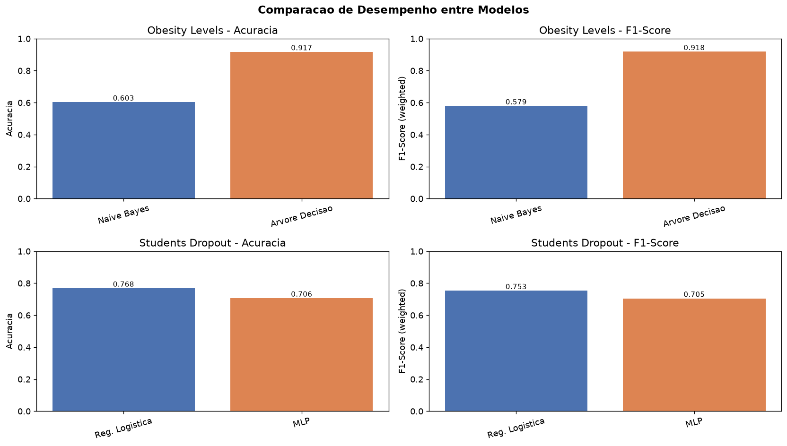
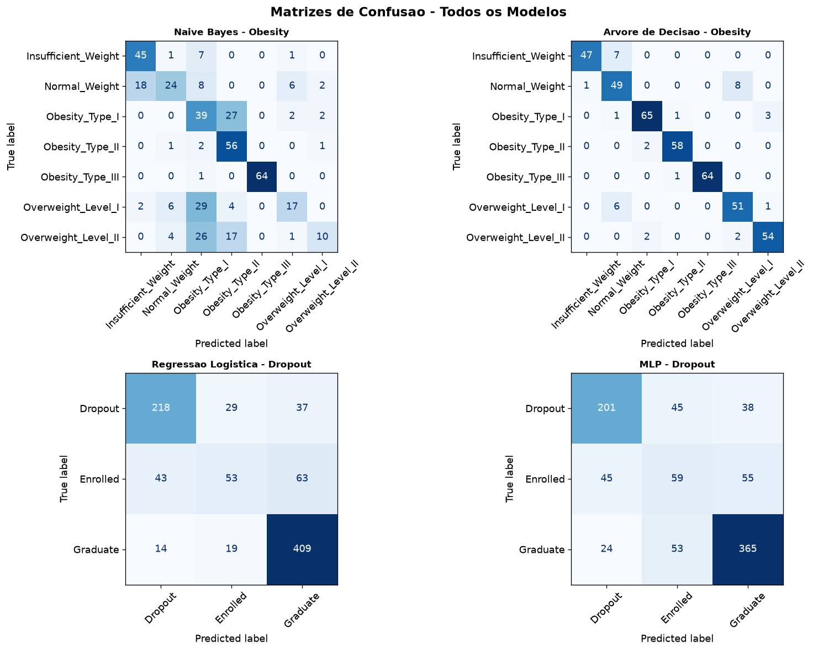

# Análise Crítica de Modelos de Inteligência Artificial

**Disciplina:** Inteligência Artificial  
**Alunos:** Gabriel Dienstmann, Lorenzo Panato (adicionar outros)  
**Professora:** Katherine Bianchini Esper  
**Instituição:** PUCRS  
**Entrega:** 25/06/2026

---

Este trabalho aplica e compara modelos de Aprendizado de Máquina supervisionado em dois datasets de classificação. Para cada dataset foi utilizado um modelo obrigatório e um modelo complementar, totalizando quatro modelos avaliados. Os resultados foram analisados por meio de Acurácia, F1-Score e Matriz de Confusão, com variação sistemática de hiperparâmetros para avaliar o impacto de cada configuração no desempenho.

---

## 1. Descrição dos Datasets Utilizados

### 1.1 Estimation of Obesity Levels

Contém dados de 2.111 indivíduos coletados por plataforma online, com o objetivo de classificar o nível de obesidade com base em hábitos de vida. A variável alvo é `NObeyesdad`, com 7 classes: Insufficient Weight, Normal Weight, Overweight Level I, Overweight Level II, Obesity Type I, Obesity Type II e Obesity Type III. Os atributos incluem gênero, idade, altura, peso, histórico familiar de sobrepeso, hábitos alimentares, prática de atividade física e meio de transporte, totalizando 16 variáveis. A distribuição das classes é relativamente balanceada, com entre 272 e 351 amostras por classe.

O pré-processamento consistiu em aplicar `LabelEncoder` nas colunas categóricas para convertê-las em valores numéricos. Não foi feita normalização, pois os modelos aplicados neste dataset, Naive Bayes e Árvore de Decisão, não dependem da escala dos dados.

### 1.2 Students Dropout and Academic Success

Contém dados de 4.424 estudantes universitários, com o objetivo de prever se o aluno vai se formar, evadir ou continuar matriculado. A variável alvo é `Target`, com 3 classes: Graduate (2.209), Dropout (1.421) e Enrolled (794). Os atributos cobrem desempenho acadêmico (unidades curriculares aprovadas, avaliações realizadas), dados socioeconômicos (situação financeira, bolsas de estudo, indicadores econômicos) e informações demográficas, totalizando 36 variáveis.

A classe Enrolled possui aproximadamente metade das amostras das outras duas, o que representa um leve desbalanceamento. O pré-processamento incluiu `LabelEncoder` no target e `StandardScaler` em todas as features, pois Regressão Logística e MLP são sensíveis à escala. Sem normalização, atributos com valores numericamente maiores teriam peso desproporcional no aprendizado.

Em ambos os datasets a divisão treino/teste foi feita pelo método **Holdout** (80% treino, 20% teste), de forma estratificada para manter a proporção das classes nos dois conjuntos.

---

## 2. Modelos Aplicados

### 2.1 Naive Bayes (obrigatório, Dataset Obesity)

Classificador baseado no **Teorema de Bayes**. Para cada exemplo novo, calcula a probabilidade de pertencer a cada classe dado seus atributos, e retorna a classe com maior probabilidade. A premissa do modelo é que os atributos são condicionalmente independentes entre si, o que raramente é verdade na prática, mas permite que o algoritmo seja eficiente e de fácil implementação.

A versão utilizada foi o **GaussianNB**, que assume distribuição normal dos atributos dentro de cada classe, estimando a média e a variância a partir dos dados de treino.

### 2.2 Árvore de Decisão (complementar, Dataset Obesity)

Aprende uma sequência de regras Se/Então a partir dos dados. Em cada nó, o algoritmo escolhe o atributo que melhor separa as classes usando um critério de impureza: Gini ou Entropia. O processo se repete até que os nós finais (folhas) contenham amostras majoritariamente de uma única classe.

A Árvore de Decisão foi escolhida como modelo complementar por ser um contraponto direto ao Naive Bayes: enquanto o Naive Bayes assume independência entre atributos, a Árvore aprende combinações condicionais entre eles sem nenhuma suposição prévia sobre a distribuição dos dados. Além disso, é um modelo interpretável cujas regras podem ser visualizadas, o que facilita a análise crítica dos resultados.

### 2.3 Regressão Logística (obrigatório, Dataset Dropout)

Aprende uma combinação linear dos atributos e aplica a **função Sigmóide** para converter o resultado em uma probabilidade entre 0 e 1. O treinamento busca os coeficientes que minimizam o erro pelo algoritmo de **Gradiente Descendente**, ajustando iterativamente os parâmetros do modelo.

### 2.4 Redes Neurais MLP (complementar, Dataset Dropout)

Rede neural com camadas ocultas, onde cada neurônio calcula a soma ponderada de suas entradas e aplica uma função de ativação. O treinamento utiliza **Backpropagation**: o erro é calculado na saída e propagado de volta pela rede, ajustando os pesos de cada camada pelo Gradiente Descendente. O processo se repete por várias épocas até o modelo convergir.

O MLP foi escolhido como modelo complementar à Regressão Logística por representar uma abordagem fundamentalmente diferente: enquanto a Regressão aprende uma fronteira linear entre as classes, o MLP é capaz de aprender fronteiras não-lineares por meio de suas camadas ocultas. Isso torna os dois modelos um par interessante para comparação em um mesmo dataset.

---

## 3. Hiperparâmetros Testados e Impacto nos Resultados

### 3.1 Naive Bayes: `var_smoothing`

Adiciona uma constante à variância estimada de cada atributo, evitando probabilidade zero quando um valor não aparece nos dados de treino. Esse conceito é equivalente ao **Estimador de Laplace** visto em aula.

| var_smoothing | Acurácia | F1-Score |
| ------------- | -------- | -------- |
| 1e-12         | 59,81%   | 0,5730   |
| 1e-9          | 60,28%   | 0,5792   |
| 1e-6          | 61,47%   | 0,5928   |
| 1e-3          | 65,48%   | 0,6420   |
| 1e-1          | 52,72%   | 0,5202   |

Aumentar o valor melhorou o desempenho progressivamente até 1e-3, onde o modelo atingiu seu melhor resultado (65,48%). A partir desse ponto, o efeito se inverte: com 1e-1, a suavização excessiva distorce as distribuições aprendidas e prejudica a capacidade do modelo de separar as classes, resultando em queda expressiva para 52,72%.

### 3.2 Árvore de Decisão: `max_depth` e `criterion`

| Configuração      | Acurácia | F1-Score |
| ----------------- | -------- | -------- |
| depth=3, gini     | 66,43%   | 0,6221   |
| depth=5, gini     | 81,32%   | 0,8138   |
| depth=10, gini    | 91,02%   | 0,9111   |
| depth=None, gini  | 91,73%   | 0,9182   |
| depth=5, entropy  | 83,69%   | 0,8356   |
| depth=10, entropy | 93,62%   | 0,9364   |

A profundidade foi o hiperparâmetro com maior impacto: entre depth=3 e depth=10 a acurácia subiu mais de 25 pontos percentuais, o que indica que o problema exige regras hierárquicas mais complexas para separar as 7 classes corretamente. Quanto ao critério, a Entropia produziu resultados ligeiramente superiores ao Gini na mesma profundidade, com a melhor configuração geral sendo depth=10 com Entropia, alcançando 93,62%.

### 3.3 Regressão Logística: `C` e `solver`

| Configuração  | Acurácia | F1-Score |
| ------------- | -------- | -------- |
| C=0.01, lbfgs | 76,27%   | 0,7378   |
| C=0.1, lbfgs  | 77,74%   | 0,7611   |
| C=1.0, lbfgs  | 76,84%   | 0,7531   |
| C=10.0, lbfgs | 77,18%   | 0,7571   |
| C=1.0, saga   | 76,84%   | 0,7531   |
| C=10.0, saga  | 77,18%   | 0,7571   |

O desempenho foi estável entre todas as configurações, com variação inferior a 2 pontos percentuais. O melhor resultado foi obtido com C=0.1, que aplica regularização um pouco mais forte que o valor padrão, sugerindo que o modelo base (C=1.0) já apresenta leve tendência ao overfitting. O solver não influenciou os resultados: lbfgs e saga produziram valores idênticos para os mesmos valores de C, indicando que o algoritmo de otimização não é o fator limitante neste problema.

### 3.4 MLP: `hidden_layer_sizes` e `learning_rate_init`

| Configuração       | Acurácia | F1-Score |
| ------------------ | -------- | -------- |
| (50,) lr=0.001     | 71,19%   | 0,7099   |
| (100,) lr=0.001    | 70,62%   | 0,7050   |
| (200,) lr=0.001    | 70,51%   | 0,7029   |
| (100, 50) lr=0.001 | 70,51%   | 0,7106   |
| (100,) lr=0.01     | 71,30%   | 0,7137   |
| (100,) lr=0.0001   | 76,38%   | 0,7567   |

A taxa de aprendizado foi o hiperparâmetro decisivo: reduzir o `learning_rate_init` de 0.001 para 0.0001 elevou a acurácia de 70,62% para 76,38%, uma melhora de quase 6 pontos. Isso indica que a taxa padrão era alta demais, causando oscilação do Gradiente Descendente sem convergência estável. O tamanho da rede, por sua vez, não teve impacto relevante: aumentar de 50 para 200 neurônios ou adicionar uma segunda camada oculta não trouxe ganho, chegando a piorar levemente o desempenho em algumas configurações.

---

## 4. Comparação entre Modelos

**Dataset Obesity Levels:**

| Modelo            | Acurácia | F1-Score |
| ----------------- | -------- | -------- |
| Naive Bayes       | 60,28%   | 0,5792   |
| Árvore de Decisão | 91,73%   | 0,9182   |

**Dataset Students Dropout:**

| Modelo              | Acurácia | F1-Score |
| ------------------- | -------- | -------- |
| Regressão Logística | 76,84%   | 0,7531   |
| MLP                 | 70,62%   | 0,7050   |

No dataset de Obesity, a diferença de mais de 31 pontos percentuais entre os modelos tem explicação direta nas características do problema. O Naive Bayes assume que os atributos são independentes entre si, mas peso, altura e hábitos alimentares são variáveis fortemente correlacionadas. Quando essa premissa é violada, o modelo acaba contabilizando a mesma evidência múltiplas vezes ao calcular as probabilidades, o que distorce as predições. A Matriz de Confusão deixa isso evidente: as classes intermediárias de sobrepeso (Overweight Level I e II) foram as mais prejudicadas, com recall de apenas 29% e 17%, respectivamente. A Árvore de Decisão não faz nenhuma suposição sobre a relação entre atributos e aprende regras condicionais diretamente dos dados, o que se mostrou muito mais adequado para separar 7 classes com atributos interdependentes.

No dataset de Dropout, o resultado contraintuitivo, com o modelo mais simples superando a rede neural, também tem explicação clara. Com 4.424 amostras e 36 atributos, o volume de dados é relativamente pequeno para o MLP. Redes neurais possuem muitos parâmetros para ajustar e precisam de grandes volumes de dados para generalizar bem. A Regressão Logística, com bem menos parâmetros, se beneficia justamente dessa limitação. Vale notar que, ao ajustar a taxa de aprendizado do MLP para 0.0001, o modelo chegou a 76,38%, praticamente empatando com a Regressão Logística (76,84%), o que sugere que a diferença entre os dois se deve mais à configuração inadequada do MLP do que a uma superioridade estrutural da Regressão para este problema.

---

## 5. Generalização, Overfitting/Underfitting e Interpretabilidade

**Naive Bayes** apresentou underfitting claro no dataset de obesidade. A acurácia de 60% em teste, mesmo com o melhor hiperparâmetro testado (65,48%), indica que o modelo não tem capacidade suficiente para aprender os padrões deste problema. O erro não é de ajuste excessivo aos dados de treino, mas de uma premissa estrutural inadequada para o tipo de dado. O modelo é de fácil interpretação em termos probabilísticos, mas sua aplicabilidade é limitada quando os atributos não são independentes.

**Árvore de Decisão** generalizou bem, com desempenho consistente em todas as 7 classes. O risco de overfitting é real, especialmente com `depth=None`, em que a árvore cresce livremente até separar perfeitamente os dados de treino. Neste caso, porém, os resultados em teste se mantiveram altos, o que indica que os padrões do dataset são suficientemente estruturados para não haver memorização excessiva. É o modelo mais interpretável dos quatro: as regras aprendidas podem ser visualizadas como uma árvore e explicadas em linguagem natural, o que é uma vantagem relevante em contextos onde a decisão precisa ser justificada.

**Regressão Logística** apresentou boa generalização no dataset de Dropout, com desempenho estável entre todas as variações de hiperparâmetro. A regularização via parâmetro C atua diretamente sobre isso, penalizando coeficientes muito elevados e impedindo que o modelo se ajuste demais ao treino. A classe Enrolled obteve F1 de apenas 0,41, mas isso se deve ao desbalanceamento do dataset e não a overfitting. Os coeficientes aprendidos têm interpretação direta (cada um representa o peso de um atributo na decisão), o que coloca a Regressão Logística em uma posição intermediária em termos de interpretabilidade.

**MLP** foi o modelo com maior risco de overfitting neste trabalho. Com menos de 5.000 amostras e muitos pesos distribuídos nas camadas ocultas, a rede tem mais facilidade de memorizar os dados de treino do que aprender padrões generalizáveis. O melhor desempenho foi obtido com a menor taxa de aprendizado testada (0.0001), o que força uma convergência mais gradual e controlada, reduzindo o risco de ajuste excessivo. Em termos de interpretabilidade, o MLP é o modelo mais opaco: os pesos das camadas ocultas não têm significado direto e não é possível extrair regras compreensíveis a partir deles, ao contrário da Árvore de Decisão ou dos coeficientes da Regressão Logística.

---

## 6. Conclusão

Os resultados obtidos reforçam que a escolha do modelo deve levar em conta as características do problema e dos dados, e não apenas o desempenho esperado em termos abstratos. No dataset de obesidade, a Árvore de Decisão superou amplamente o Naive Bayes porque o problema envolve atributos correlacionados e múltiplas classes, condições que favorecem modelos baseados em regras condicionais. No dataset de evasão acadêmica, a Regressão Logística superou o MLP em um cenário com volume de dados limitado, onde a capacidade adicional da rede neural não se traduziu em melhor generalização.

A análise de hiperparâmetros mostrou que a configuração dos modelos tem impacto direto nos resultados. No MLP, ajustar apenas a taxa de aprendizado foi suficiente para aproximar o desempenho da Regressão Logística. Na Árvore de Decisão, a profundidade foi o fator mais determinante, com ganhos expressivos conforme as regras se tornavam mais complexas. Esses resultados mostram que escolher bem o modelo é apenas parte do trabalho: configurá-lo adequadamente para o problema é igualmente importante.

As principais limitações do trabalho estão na metodologia de avaliação e no tratamento dos dados. A divisão única de treino e teste pelo método Holdout torna os resultados dependentes do sorteio realizado. Um protocolo como K-Fold Cross Validation produziria estimativas mais confiáveis e menos sensíveis à divisão específica utilizada. Além disso, o desbalanceamento da classe Enrolled no dataset de Dropout não foi tratado, o que prejudicou o desempenho de todos os modelos nessa classe e pode ter mascarado diferenças reais entre eles.
